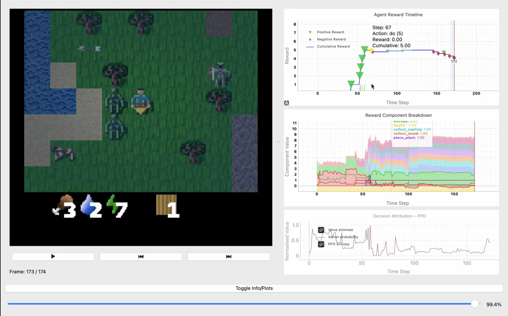

# Crafter Project – Visual Demo & Agent Analysis

This project includes training, evaluation, and visualization modules for analyzing reinforcement learning agents in the [Crafter environment](https://github.com/danijar/crafter). The agents used include **DreamerV2** and **PPO**, with a custom-built visualization UI to explore behaviors and decisions.

---

## 📽️ Demo of Visualization UI

> Explore how the custom-built UI visualizes reward signals, action trajectories, and state transitions.

📎 [Click here to watch the full demo video](https://drive.google.com/file/d/1GvucbAHuXWmhE8PJqDv-3kwOFSbceZ2B/view)

[](https://drive.google.com/file/d/1GvucbAHuXWmhE8PJqDv-3kwOFSbceZ2B/view)

*(Click the image above to open the demo video hosted on Google Drive)*

---

## 📊 Selected Plot Outputs

Visualizations from both Dreamer and PPO runs:

| Plot | Description |
|------|-------------|
|  | **Reward Timeline**: Cumulative reward over time |
|  | **Action Probabilities**: Policy’s action distribution |
|  | **Exploration Bonus**: Internal motivation to explore |
|  | **Decomposed Rewards**: Contributions from each sub-reward |
|  | **Value Estimate**: Predicted return at each step |
|  | **World Model Confidence**: Quality of latent model predictions |

---

# ⚙️ Running the Modules

This repo includes three main modules:

- **Visualization** (`viz/`)
- **DreamerV2 agent** (`dreamer/`)
- **PPO agent** (`ppo/`)

---

## 🚀 Quick Start

| Task                    | Script Path                | Command                             |
|-------------------------|----------------------------|-------------------------------------|
| Visualization UI        | `viz/VisMain.py`           | `python viz/VisMain.py`             |
| Dreamer Training        | `dreamer/dreamer_train.py` | `python dreamer/dreamer_train.py`   |
| Dreamer Evaluation      | `dreamer/environment.py`   | `python dreamer/environment.py`     |
| PPO Training            | `ppo/train_ppo_crafter.py` | `python ppo/train_ppo_crafter.py`   |
| PPO Evaluation          | `ppo/eval_ppo_crafter.py`  | `python ppo/eval_ppo_crafter.py`    |

---

## 🔧 Prerequisites

Before starting:

1. Activate your Python virtual environment (if applicable).
2. Install dependencies:
   ```bash
   pip install -r requirements.txt

## Notes

1. ⁠*Model Checkpoints:*  
  Always ensure that you have a trained model checkpoint before attempting to run any evaluation script.

2. ⁠*Custom Paths:*  
  Paths for saving models, logs, or results can be adjusted inside each script depending on your project organization.
